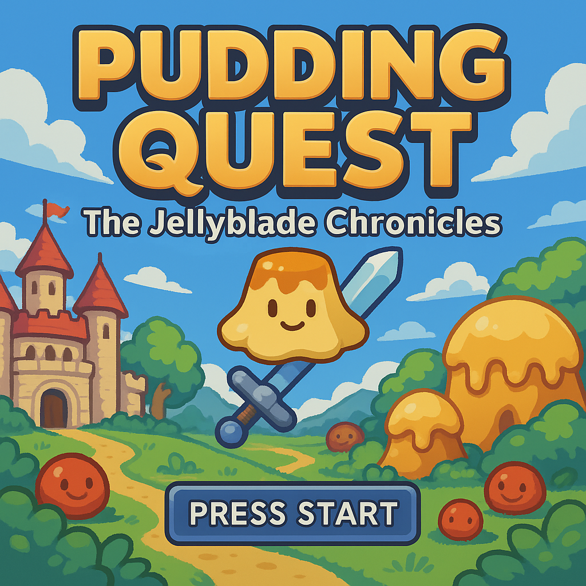
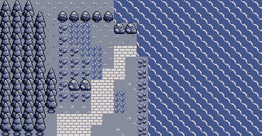

# 2D RPG React Game

A full-stack gaming project using Remix and Hono.js.



## Game Features

- **Title Screen**: Custom title screen with interactive buttons
- **Multiple Maps**: Overworld, Castle, and Castle Floor maps with unique layouts
- **Map Transitions**: Seamless transitions between different game areas
- **Collision Detection**: Advanced collision system with different terrain types
- **NPC Interactions**: Dialog system with interactive NPCs
- **Debug Mode**: Toggle debug mode to view collision maps and paths

## Game Assets

- **Title Screen**: `public/images/titlePage.png` - The main title screen background
- **Overworld**: `public/maps/background.png` - The main game world
- **Castle**: `public/maps/castle.png` - The castle interior
- **Castle Floor**: `public/maps/castleFloor.png` - The castle's inner chambers
- **Character Sprites**: `public/characters.png` - Character sprite sheet
- **Tiles**: `public/tiles.png` - Tileset for the game world

## Project Structure

- `apps/frontend` - Remix TypeScript frontend
  - `app/lib/gameEngine.ts` - Core game logic
  - `app/lib/mapData.ts` - Map layouts and collision data
  - `app/components/TitlePage.tsx` - Title screen component
- `apps/backend` - Hono.js TypeScript backend

## Getting Started

1. Install dependencies:

```bash
npm install
```

2. Start development servers:

```bash
npm run dev
```

This will start:

- Frontend at http://localhost:3000
- Backend at http://localhost:3001

## Game Controls

- **Arrow Keys**: Move the player character
- **E or Space**: Interact with NPCs and objects
- **D**: Toggle debug mode (requires REMIX_PUBLIC_DEBUG_MODE=true in .env)

## Development

- Frontend is built with Remix and TypeScript
- Backend uses Hono.js with TypeScript
- Uses Turborepo for monorepo management
- Custom game engine built with Canvas API
- Responsive design with mobile support

## Deployment to Vercel

### Frontend Deployment

1. Create a `vercel.json` file in the `apps/frontend` directory:

```json
{
  "framework": "remix",
  "buildCommand": "npm run build",
  "outputDirectory": "public",
  "routes": [
    {
      "src": "/(.*)",
      "dest": "/"
    }
  ],
  "env": {
    "REMIX_PUBLIC_DEBUG_MODE": "false"
  }
}
```

2. Install the Vercel CLI:

```bash
npm install -g vercel
```

3. Deploy the frontend:

```bash
cd apps/frontend
vercel
```

4. Follow the prompts to link your project to a Vercel account.

5. For subsequent deployments, you can use:

```bash
vercel --prod
```

### Backend Deployment (Optional)

1. Create a separate Vercel project for the backend:

```bash
cd apps/backend
vercel
```

2. Set the backend URL as an environment variable in your frontend project:

```bash
vercel env add REMIX_PUBLIC_API_URL https://your-backend-url.vercel.app
```

### Deploying from GitHub

1. Push your repository to GitHub.

2. Connect your GitHub repository to Vercel:
   - Go to [vercel.com](https://vercel.com) and sign in
   - Click "Add New..." > "Project"
   - Select your GitHub repository
   - Configure the project:
     - Root Directory: `apps/frontend`
     - Framework Preset: Remix
   - Add environment variables if needed
   - Click "Deploy"

3. Vercel will automatically deploy your project and provide a URL.

## Map System

The game features multiple maps with different tile sizes:
- Overworld: 80px tiles (20x15 grid)
- Castle: 120px tiles (16x12 grid)
- Castle Floor: 120px tiles (12x10 grid)

Each map has transition points that allow the player to move between areas while maintaining relative position.


